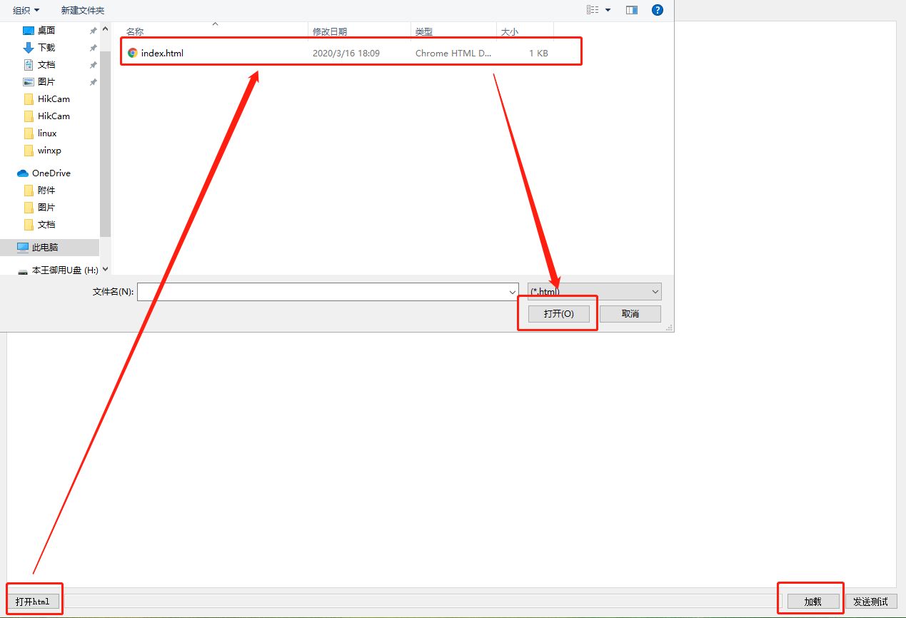
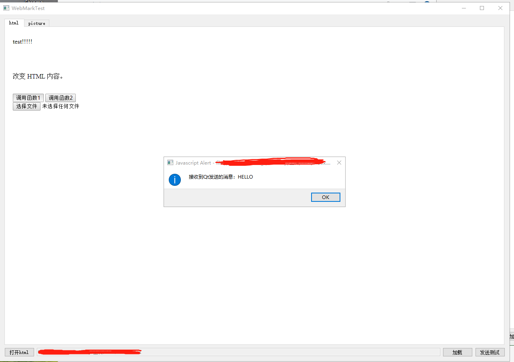
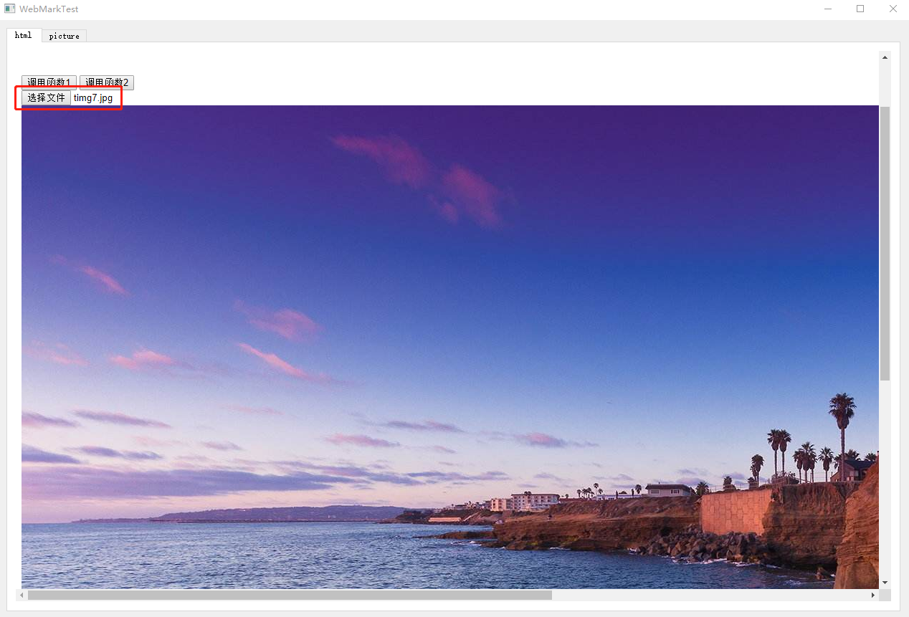

# QWebEngineWidget通信示例

## 开发环境：
Visual Studio 2017 + QT5.12

***注意：QT需要有QWebEngineWidget模块***

## 功能介绍
借助QWebEngineWidget实现网页的展示，同时需要实现QT Application对网页内容的数据交互。

### 实现效果
1.通过手动打开“打开html”文件按钮，提前写好的html文件，在html目录下的index.html。

2.点击加载按钮，加载出html内容

### 功能1：发送普通数据
点击页面中的“测试1”按钮，正常情况会弹出“HELLO”字样的弹框。

这部分弹框是通过recvMessage的调用显示的。正常弹出，说明数据可以从网页传到QT，同时QT的数据也可以传回数据。

### 功能2：QT主动发送消息
点击QT右下角的“发送测试”按钮，正常情况会弹出“HELLO”字样的弹框。

### 功能3：测试图片收发功能
点击选择图片，然后选中本地任意一张图片。在第二个标签页中可以查看到图片信息。

同时会截取图片的部分
说明通信可以正常传输图片。

#### 参考:https://www.jianshu.com/p/e25646ee2977

